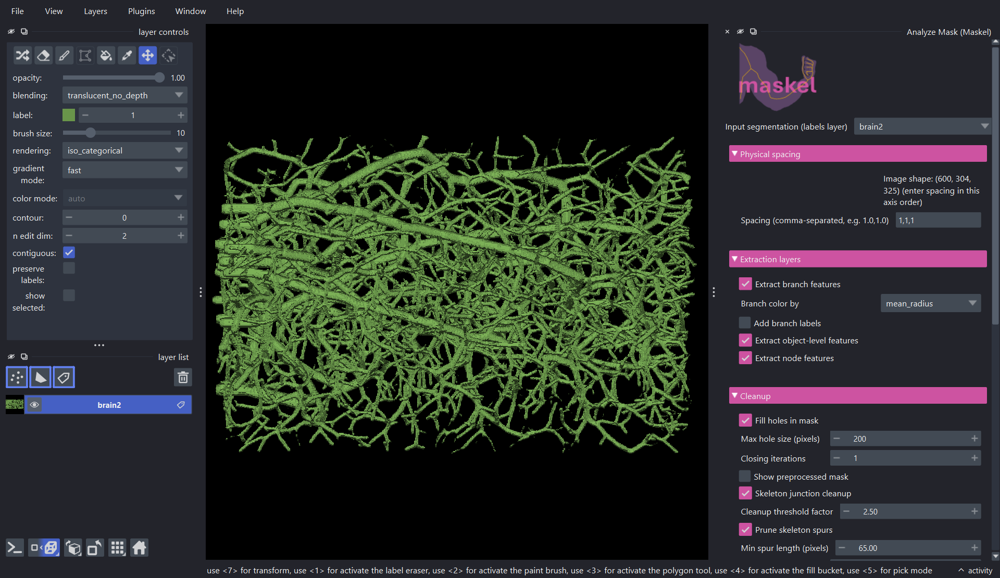
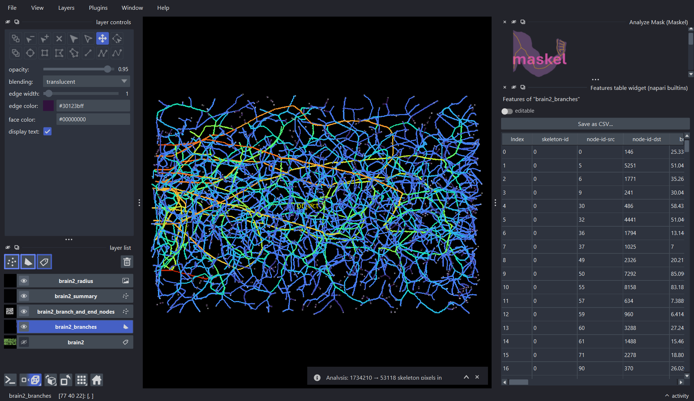
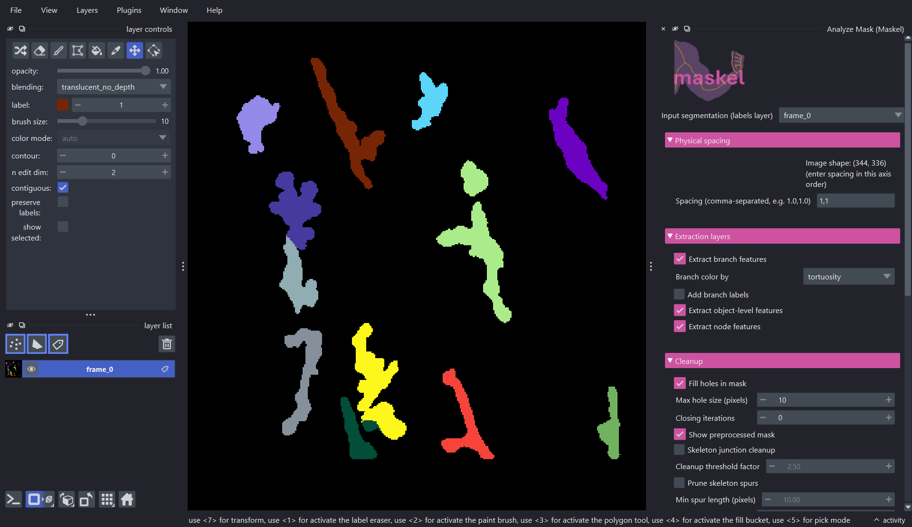
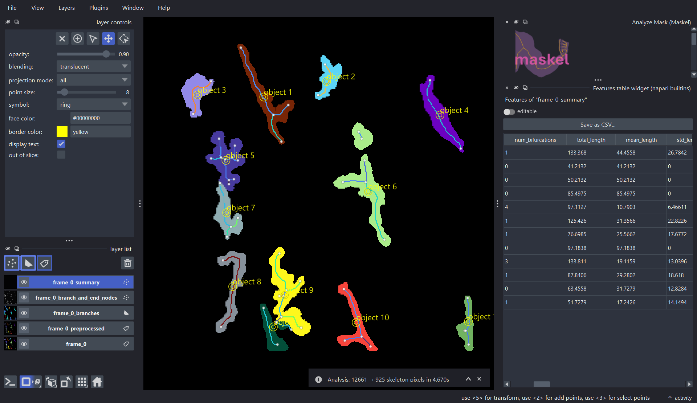

napari plugin for **[maskel](https://bionetslab.github.io/maskel/)**: skeletonization and graph-based feature extraction for branching biological structures — vasculature, fibers, neurites, and other network-like objects — with interactive visualization of branches and node features.

This repo owns the interactive widget and napari-layer visualization only — the algorithm itself (thinning, feature extraction, the batch CLI) lives in maskel, which napari-maskel depends on as a normal package.

See [Installation](installation.md) to get set up.

## Examples

### 3D binary mask

This is an example of running maskel on a 3D binary segmentation mask. The data is the [VessAP](https://github.com/vessap/vessap) brain volume (`data/1.nii.gz`), turned into a binary mask with Gaussian blur and Otsu thresholding.

Clicking **Analyze mask** adds whichever intermediate layers were requested. Opening napari's built-in feature table widget alongside the branches layer lets you inspect the object-, branch-, and node-level characteristics maskel extracted, right in the viewer — each level characterizing the vasculature's topology and branching behavior at a different granularity. You can also specify an output directory to write these features to disk.

### 2D multi-label mask

A multi-object instance segmentation map (more than one distinct nonzero label) is skeletonized independently per object. This example is the first frame of a video, `MacrophageData_V2/NpyData/EMMACtrl_2021-05-19_visual_labels.npy`, from [Zenodo record 13929787](https://zenodo.org/records/13929787).

Every branch, node, and summary point is tagged with the `object_id` it came from, so the per-object feature table stays consistent with the IDs in the original mask. Since this is one frame of a longer video, saving the extraction settings with **Save recipe** lets you run maskel on the rest of the frames — via the [CLI](https://bionetslab.github.io/maskel/cli/) (`maskel run --config`) — without reconfiguring anything by hand. This lets you configure a processing workflow on one example frame and then apply it to the rest, reproducibly extracting temporal morphological features for each cell across the video.

## General usage

1. Open a segmentation mask (2D or 3D) in napari and convert it to a **labels layer**.
2. Run **Analyze mask (Maskel)** from the Plugins menu to open the widget, and pick that layer as the **Input segmentation**.
3. Configure the extraction, cleanup, and output parameters described below (or click **Load recipe** to load a saved preset).
4. Click **Analyze mask**. The resulting layers (branches, nodes, object summary, radius, preprocessed mask — whichever are enabled) are added to the viewer.
5. Open napari's built-in **features table** widget from the Plugins menu and select one of the added layers to inspect its object-, branch-, or node-level features as a sortable, exportable table.
6. Optionally pick an output directory so the enabled file exports are written to disk.

## Configurable parameters

**Input segmentation (labels layer)** — the mask to analyze. A plain binary mask is treated as a single object; a mask with more than one distinct nonzero value is treated as an instance segmentation and each label is skeletonized independently as its own object (even where two objects touch).

### Physical spacing

- **Spacing** — comma-separated physical pixel/voxel size, one value per axis (e.g. `1.0,1.0`). Pre-filled from the selected layer's own `.scale`. When set, length/radius/area/volume features come out in physical units instead of pixel units. An invalid value (wrong number of axes, or unparsable) shows an inline warning and falls back to pixel units for that run.

### Extraction layers

- **Extract branch features** — extracts per-branch features for CSV export or visualization. Adds the `{name}_branches` layer (skeleton drawn as colored paths).
- **Branch color by** — branch property used to color that layer's edges (`object_id`, `tortuosity`, `straightness`, `mean_radius`, ...); only enabled once branch features are on. Radius-based properties need **Radius features** (Advanced, below) enabled too, or a warning appears. Changing it after **Analyze mask** has run recolors the existing branches layer immediately, without re-running the analysis.
- **Add branch labels** — overlays branch ID, length, and tortuosity as text on the branches layer. Adds the `{name}_branch_text` layer.
- **Extract object-level features** — computes per-object summary features (bifurcation count, total/mean length, etc.). Adds the `{name}_summary` layer, one point per object at its skeleton centroid.
- **Extract node features** — extracts per-node features. Adds the `{name}_branch_and_end_nodes` layer, showing only branch/end nodes (degree ≠ 2) colored by degree — pass-through points along a straight run are omitted from the display, though the exported node CSV still includes every node.

### Cleanup

- **Fill holes in mask** — fills holes in the binary segmentation before thinning.
- **Max hole size (pixels)** — caps which hole sizes get filled when the above is on; `0` fills all holes.
- **Closing iterations** — morphological closing iterations applied before thinning; `0` disables it.
- **Show preprocessed mask** — enabled once fill-holes or closing is active; adds a `{name}_preprocessed` labels layer showing the mask as it looked right before thinning.
- **Skeleton junction cleanup** — collapses ambiguous junction pixel clusters left behind by thinning.
- **Cleanup threshold factor** — sensitivity for the above; enabled only once it's on. Higher values collapse larger clusters.
- **Prune skeleton spurs** — removes short endpoint-to-junction branches that are thinning artifacts rather than real structure.
- **Min spur length** — branches shorter than this qualify as spurs; enabled only once pruning is on. In pixels by default, or in physical units once **Spacing** is set.
- **Spur iterations** — how many times pruning repeats on its own output, since removing one spur can expose another; enabled only once pruning is on.

### Advanced features

- **Fractal dimension** — computes the skeleton's box-counting fractal dimension as a summary feature. Only valid for isotropic voxels, so it's forced to `0.0` (with a warning) if **Spacing** is set and anisotropic.
- **Radius features** — estimates local vessel radius via a Euclidean distance transform of the segmentation. Adds the `{name}_radius` image layer (per-pixel radius overlaid on the skeleton) and unlocks the radius-based **Branch color by** properties above.

### Output settings

These write results to disk rather than adding napari layers, once an output directory is selected below.

- **Write skeleton (.npy)** — the skeleton array.
- **Write skeleton (.png)** — the binary skeleton mask (skipped with a warning for 3D input).
- **Write summary csv** — aggregated per-object features.
- **Write branch csv** — per-branch feature tables (requires **Extract branch features**).
- **Write node csv** — per-node feature tables (requires **Extract node features**).
- **Write radius matrix (.npy)** — the per-pixel radius array (requires **Radius features**).
- **Write graph (.graphml)** — the skeleton graph (nodes = graph nodes, edges = branches) as GraphML.
- **Write networkx graph (.pkl)** — the same graph as a pickled `networkx.MultiGraph`, richer than GraphML (keeps NaN values and native Python types) but only readable from Python.
- **Select output directory...** — required once any of the above is checked; a warning shows until one is picked.

## Sharing a config with the CLI

The **Recipe** section's **Save recipe** button exports the current extraction and output settings as a reusable JSON preset — the same preset the [maskel CLI](https://bionetslab.github.io/maskel/cli/) consumes for batch processing (`maskel run --config`). **Load recipe** reads one back into the widget. See the [Configuration Reference](https://bionetslab.github.io/maskel/configuration/) for every field in that schema.

## License

napari-maskel is released under the **MIT License**. See [LICENSE](https://github.com/bionetslab/napari-maskel/blob/main/LICENSE) for details.
